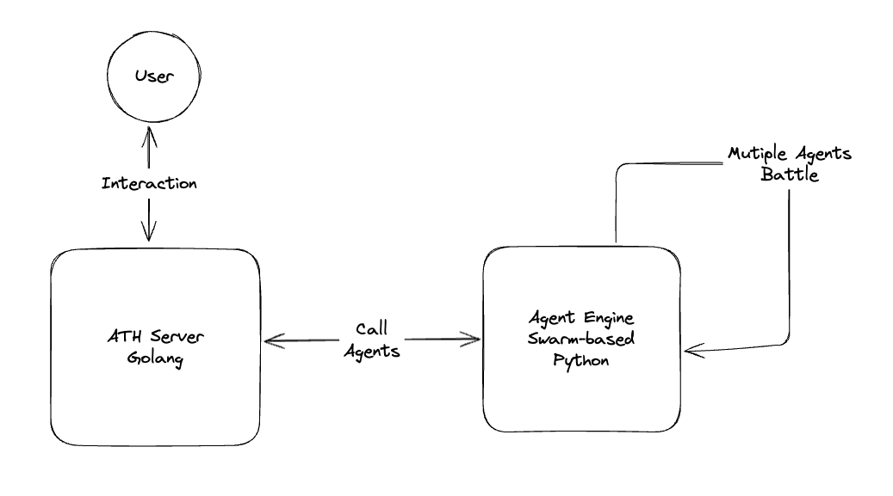

# All-Time-High Agent Engine Powered by Swarms

## Overview
This project provides an AI Agent Engine designed for the all-time-high project, in order to support multiple agents orchestration. It offers endpoints for creating agents and evaluating battles between agents by leveraging state-of-the-art LLM models.

This project is powered by [Swarms](https://github.com/kyegomez/swarms)

## Architecture
The Engine serves as a plugin into the All Time High project.



## Features
- **Heartbeat Endpoint**: Test the availability of the API.
- **Create Agent Endpoint**: Generate a new swarms agent by specifying an agent name and a prompt.
- **Evaluate Battle Endpoint**: Evaluate player-versus-player (PvP) battles between agents using provided attacker and defender prompts.

## API Endpoints

### Heartbeat
- **URL**: `/api/heartbeat`
- **Method**: GET
- **Response**:
  ```json
  { "status": "ok" }
  ```

### Create Agent
- **URL**: `/api/createAgent`
- **Method**: GET
- **Query Parameters**:
  - `agent_name`: Name to be assigned to the agent.
  - `prompt`: Initial prompt for the agent.
- **Response**:
  ```json
  { "response": "Agent creation response text" }
  ```

### Evaluate Battle
- **URL**: `/api/evaluateBattle`
- **Method**: GET
- **Query Parameters**:
  - `attacker_name`: Attacker agent's name.
  - `attacker_prompt`: Prompt associated with the attacker.
  - `defender_name`: Defender agent's name.
  - `defender_prompt`: Prompt associated with the defender.
- **Response**:
  ```json
  { "result": "Battle evaluation result" }
  ```

## Setup and Installation

1. **Clone the Repository**
   ```bash
   git clone <repository-url>
   cd <repository-directory>
   ```

2. **Create a Virtual Environment and Install Dependencies**
   ```bash
   python -m venv venv
   source venv/bin/activate  # For Windows, use `venv\Scripts\activate`
   pip install -r requirements.txt
   ```

3. **Configure Environment Variables**
   - Create a `.env` file in the project root directory.
   - Add the following configuration:
     ```
     OPENAI_API_KEY=your_openai_api_key
     ```

4. **Run the Application**
   ```bash
   python run.py
   ```

## Project Structure
```
├── app
│ ├── init.py # Initializes the Flask app and registers the API blueprint
│ ├── api.py # Contains endpoints for creating agents and evaluating battles
│ └── agent_logic.py # Implements logic for generating agent responses and evaluating battles using OpenAI's API
├── run.py # Application entry point
└── .gitignore # Files and directories to be ignored by version control
```

## Dependencies
- Python 3.x
- Flask
- OpenAI Python package
- Additional dependencies as listed in `requirements.txt`

## License
This project is licensed under the MIT License.